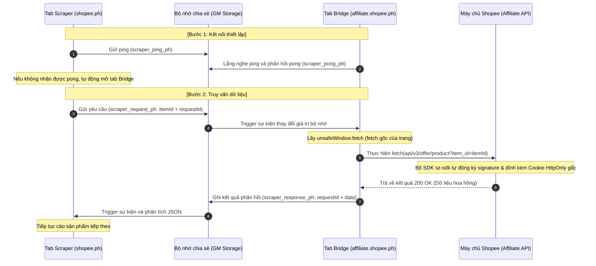

# Công nghệ Cầu nối liên kết Tab (Cross-Tab Bridge) vượt cơ chế chống Bot của Shopee

Tài liệu này ghi chép lại giải pháp công nghệ **Cross-Tab Bridge** được áp dụng thành công để vượt qua cơ chế chống bot mạnh mẽ của Shopee (Lỗi chống bot `90309999` hoặc `403 Forbidden`) khi gọi API dữ liệu hoa hồng trên `affiliate.shopee.ph`.

---

## 1. Vấn đề & Hạn chế của giải pháp truyền thống

### Cách tiếp cận cũ (Replay Headers):
* **Cách làm:** Khi người dùng truy cập trang nguồn (Ví dụ: `affiliate.shopee.ph`), tiện ích sẽ dùng hook đánh chặn để lưu các headers bảo mật (`af-ac-enc-sz-token`, `x-sap-sec`, `af-ac-enc-dat`) vào bộ nhớ `GM_setValue`. Khi chạy cào ở trang đích (`shopee.ph`), tiện ích dùng `GM_xmlhttpRequest` để gọi API chéo tên miền và gửi kèm các headers đã lưu này.
* **Nguyên nhân thất bại:** 
  1. **Token hết hạn rất nhanh:** Các token bảo mật (sz-token) của Shopee có thời gian sống cực kỳ ngắn (thường chỉ 10 - 15 giây). Việc lưu lại và phát lại (replay) sau đó chắc chắn sẽ bị quá hạn.
  2. **Chữ ký khóa theo tham số yêu cầu (Request-bound Signature):** Chữ ký chống bot được tính toán dựa trên toàn bộ URL và tham số (như `item_id`). Một token được tạo ra cho sản phẩm A không thể dùng cho sản phẩm B.
  3. **Mất Cookie HttpOnly:** Khi ghi đè thủ công header `Cookie` từ `document.cookie` của JavaScript, trình duyệt sẽ bị mất các cookie bảo mật quan trọng có thuộc tính `HttpOnly` (như `SPC_EC` - cookie giữ phiên đăng nhập), khiến API coi yêu cầu là chưa đăng nhập.

---

## 2. Kiến trúc giải pháp Cầu nối liên kết Tab (Cross-Tab Bridge)

Thay vì cố gắng giả lập hoặc gửi thủ công các header bảo mật, giải pháp này **ủy quyền (delegate)** việc gọi API cho một tab hợp lệ đang mở trên chính miền đích làm trung gian gọi API.



---

## 3. Các điểm kỹ thuật cốt lõi (Core Technical Details)

### 3.1. Khai báo Metadata Block trong Userscript
Để sử dụng cơ chế liên lạc liên tab và khởi chạy sớm, Metadata block của tiện ích Tampermonkey phải khai báo đủ các quyền:
```javascript
// ==UserScript==
// @match        https://shopee.ph/*
// @match        https://affiliate.shopee.ph/*
// @grant        GM_setValue
// @grant        GM_getValue
// @grant        GM_addValueChangeListener
// @grant        GM_removeValueChangeListener
// @connect      affiliate.shopee.ph
// @run-at       document-start
// ==/UserScript==
```
* **`@run-at document-start`**: Đảm bảo script chạy trước khi trang tải để hook kịp thời các hàm XHR/Fetch của trang.
* **`GM_addValueChangeListener` & `GM_removeValueChangeListener`**: Cần thiết để lắng nghe biến đổi dữ liệu thời gian thực giữa các tab khác nhau.

### 3.2. Vượt qua cơ chế Sandbox cách ly bằng `unsafeWindow`
Trong Tampermonkey, các mã script mặc định chạy trong môi trường Sandbox cô lập. Khi đó, biến `window` hay hàm `fetch` trong userscript là bản gốc của trình duyệt chứ không phải đối tượng đã được lớp SDK chống bot của Shopee sửa đổi.

Để cuộc gọi API của Bridge được tự động đính kèm chữ ký bảo mật, ta phải gọi trực tiếp qua `unsafeWindow` (đối tượng window thực tế của trang web nơi các script của Shopee hoạt động):
```javascript
const win = (typeof unsafeWindow !== 'undefined') ? unsafeWindow : window;

// Khi gọi API trong tab Bridge:
const response = await win.fetch(`https://affiliate.shopee.ph/api/v3/offer/product?item_id=${itemId}`, {
    headers: {
        'accept': 'application/json, text/plain, */*',
        'affiliate-program-type': '1',
        'referer': `https://affiliate.shopee.ph/offer/product_offer/${itemId}`
    }
});
```

### 3.3. Cơ chế giao tiếp Ping-Pong và Tự động mở Tab hỗ trợ
Khi bắt đầu cào sản phẩm, trang scraper cần kiểm tra xem tab Bridge có đang hoạt động hay không. Nếu không, nó sẽ tự động kích hoạt mở tab Bridge để sẵn sàng xử lý yêu cầu:

```javascript
// Gửi tín hiệu ping xem Bridge đã hoạt động chưa
let bridgeActive = false;
const pingVal = Math.random().toString();
const pongListener = GM_addValueChangeListener('scraper_pong_ph', (name, oldValue, newValue, remote) => {
    bridgeActive = true;
});

GM_setValue('scraper_ping_ph', pingVal);
await sleep(1200); // Đợi phản hồi pong trong 1.2 giây
GM_removeValueChangeListener(pongListener);

if (!bridgeActive) {
    // Mở tab làm Bridge tự động (Chạy đồng thì không bị chặn popup)
    window.open('https://affiliate.shopee.ph/', '_blank');
    await sleep(6000); // Chờ 6 giây để tab mới tải xong
}
```

---

## 4. Cách áp dụng rộng rãi (Reusability Guide)

Bạn có thể mang công nghệ này áp dụng cho bất kỳ thị trường nào (Việt Nam, Thái Lan, Singapore...) hoặc bất kỳ hệ thống nào có cơ chế chống bot bằng token động gắn với phiên hoạt động:

1. **Bước 1:** Đảm bảo Userscript của bạn khớp (`@match`) với cả hai trang: Trang cào dữ liệu (`shopee.vn`) và Trang chứa phiên hoạt động (`affiliate.shopee.vn`).
2. **Bước 2:** Đăng ký các Bridge Listener trên tab chứa phiên hoạt động để nghe tín hiệu yêu cầu API.
3. **Bước 3:** Sử dụng `unsafeWindow.fetch` hoặc `unsafeWindow.XMLHttpRequest` trên tab phiên hoạt động để thực hiện cuộc gọi thực tế nhằm mượn cơ chế ký số tự động của trang web.
4. **Bước 4:** Gửi kết quả ngược lại cho tab cào thông qua lắng nghe sự thay đổi biến toàn cục của tiện ích.
